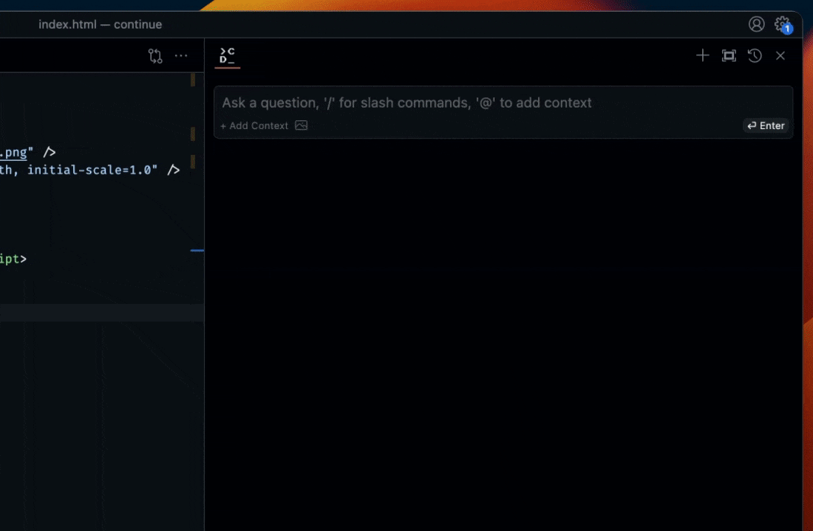
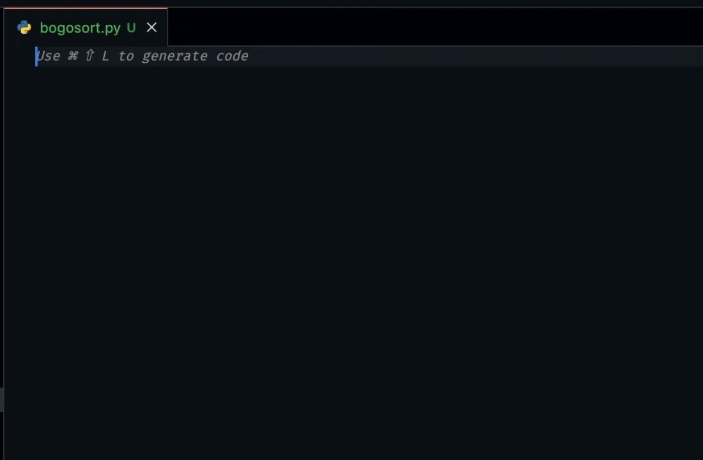

> 🎉 **Tab autocomplete now available in pre-release (experimental)**

<h1 align="center">Ahrefs-Continue</h1>

**Ahrefs-Continue is an in-house code assistant built on top of [Continue](https://continue.dev/docs).**

# ⏩ Features

# 🔎 Ask about highlighted code

Highlight + select code sections and ask a question to get another perspective

- “how can I set up a Prisma schema that cascades deletes?”
- “where in the page should I be making this request to the backend?”
- “how can I communicate between these iframes?”

# 🪄 Reference context inline

- "@diff check my commit for mistakes"
- "how does @server.py stream responses?"
- "how do i fix this error in the @terminal?"

# ⚡️ Get completions directly in your editor

# ✏️ Edit in natural language

Highlight + select a section of code and instruct Continue to refactor it

- “/edit migrate this digital ocean terraform file into one that works for GCP”
- “/edit change this plot into a bar chart in this dashboard component”
- “/edit rewrite this function to be async”

## License

This is a private extension tool that should only be used by Ahrefs employees.
